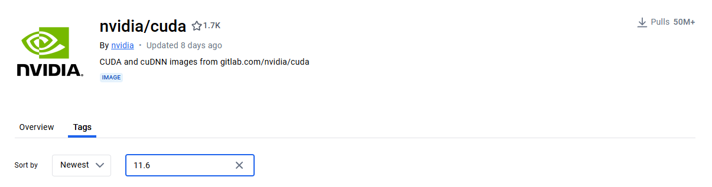

# 天智杯遥感赛道

## 上传说明

### 预备条件：

① 一个阿里云账号 `https://cr.console.aliyun.com/cn-beijing/instances/repositories` 
- 地区选择华北2（北京）
- 镜像是个人实例——私有仓库
- 设置Registry 登录密码（上传镜像需要填写）


② 已经训练好的模型和权重（不考虑环境更新），包含：

- 配置文件 config.py
- 权重文件 best.py
- 运行文件 run.py（可选）

### 步骤一：制作镜像（以CUDA11.6为例）

#### 1.确定基础环境
赛道一要求：*主机CPU架构为x86_64，运行环境包括64位Linux（Ubuntu 16.04/Ubuntu 18.04，CentOS 7）操作系统;CUDA环境要求高于等于10.0，低于12.4版本*

从 [docker hub](https://hub.docker.com/) 找到符合要求的基础镜像：① CUDA 11.6；② Ubuntu 18.04;


devel时编译时cuda；runtime是运行时cuda，会缺少编译功能，无法手动安装需要编译的包。因此选择选择cudnn+devel的配置，即`docker pull nvidia/cuda:11.6.2-cudnn8-devel-ubuntu18.04`

运行上述命令下载基础镜像到本地，一般在这里会报错，因为镜像仓库被墙了，需要在/etc/docker/daemin.json文件中配置未失效的镜像站，如下：
```json
{
  "registry-mirrors": ["https://dockerhub.icu"]
}

```

### 步骤二：配置镜像环境
刚pull的镜像什么都没有，需要手动安装python和pytorch等包，使用和dockerfile和miniconda简化安装过程。

**（1）配置dockerfile文件：**

在项目根目录创建dockerfile文件，复制以下内容；然后在终端运行`docker build -t <镜像名>:<版本号> .`，例如`docker build -t tianzhi/track1:v0 .`

```dockerfile
# 使用 CUDA 11.6 基础镜像
FROM nvidia/cuda:11.6.2-cudnn8-devel-ubuntu18.04

# 打印临时目录权限和可用空间
RUN ls -ld /tmp && df -h

# 修复临时目录权限,防止安装包报错
RUN chmod 1777 /tmp

# 配置程序依赖环境，cv2需要libgl1-mesa-glx 、libglib2.0-0
RUN apt-get update && \
    apt-get install -y --no-install-recommends \
    build-essential \
    cmake \
    curl \
    ca-certificates \
    libgl1-mesa-glx \
    libglib2.0-0 \
    libjpeg-dev \
    libpng-dev && \
    rm -rf /var/lib/apt/lists/*

# 下载并安装Miniconda, 在 https://repo.anaconda.com/miniconda 选择合适的版本下载
RUN curl -sLo /tmp/miniconda.sh https://repo.anaconda.com/miniconda/Miniconda3-py310_24.5.0-0-Linux-x86_64.sh && \
    /bin/bash /tmp/miniconda.sh -b -p /opt/miniconda && \
    rm /tmp/miniconda.sh

# 将python命令配置为minicodna的base环境的python
ENV PATH=/opt/miniconda/bin:$PATH

# 创建必要的文件夹
RUN mkdir -p /workspace
RUN mkdir -p /model_path
RUN mkdir -p /input_path
RUN mkdir -p /output_path

# 设置容器运行时的工作目录
COPY Dockerfile /workspace
```

**(2) 配置容器内环境：**

首先确保nvidia-docker 2已经安装，让容器能够使用GPU；然后运行命令`docker run --gpus all -it <镜像tag>` 启动容器,镜像tag包含镜像名和版本号，形如 tianzhi/track1:v0;

在容器的命令行安装必要的环境，如同在普通的Linux服务器上;

如果需要自定义的代码包环境，运行`docker cp`命令将本地文件传输到容器（也可以写在dockerfile中）；

环境配置完成后，先`docker ps`或其他方式找到正在运行的容器id，然后运行命令`docker commit <容器id> <镜像新tag>`将现有的容器提交为镜像，可以是新镜像，也可以是旧镜像的新版本，例如tianzhi/track1:v1


**(3) 制作提交镜像：**

首先将所有要提交的文件（配置文件和权重）放在同一个文件夹中，例如 peoject_root/commit, 然后创建新的dockerfile文件，填写以下内容：

```dockerfile
# 导入镜像环境
FROM tianzhi/track1:v1

# 复制配置文件和权重
COPY . /model_path

# 复制运行脚本 (如果修改了运行脚本)
COPY ./run.py workspace

# 确定容器启动时程序运行路径
WORKDIR /workspace

# 设置启动脚本
CMD ["python", "run.py", "/input_path", "/output_path"]
```

然后将终端工作目录切换到/commit，运行`docker build -t tianzhi/track1:v2 .`,此处即可得到最终要提交的docker文件

### 步骤三：上传阿里云

首先在docker登录阿里云，`docker login --username=<用户名> registry.cn-beijing.aliyuncs.com`

然后重命名要提交的镜像tag：`ocker tag [ImageId] registry.cn-beijing.aliyuncs.com/<仓库名>/<镜像名>:[镜像版本号]`

上传镜像：`docker push registry.cn-beijing.aliyuncs.com/<仓库名>/<镜像名>:[镜像版本号]`


在队长后台填写：镜像名称（形如registry.cn-beijing.aliyuncs.com/<仓库名>/<镜像名>:[镜像版本号]的全名） 用户名和Registry密码