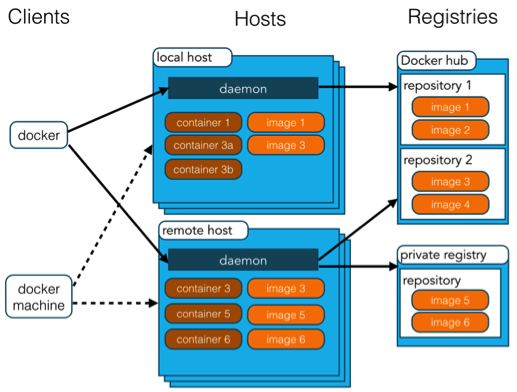

# DOCKER


## 一、镜像（Image）
Docker镜像（Docker Image）是一个轻量级、独立的、可执行的软件包，它包含了运行某个应用程序所需的一切，包括代码、运行时、库、环境变量和配置文件。Docker镜像是创建Docker容器的基础，每个容器都是从一个镜像实例化而来的。

### 1. 特点
- **分层结构**：Docker镜像是由多个只读层（layer）组成的，每一层代表镜像的一次变更。镜像的分层结构允许高效地共享和重用资源。例如，如果多个镜像都基于同一个基础镜像（如ubuntu），那么它们可以共享该基础镜像的层，节省存储空间。
- **只读性质**：Docker镜像是只读的。当容器从镜像启动时，会在镜像的顶层添加一个可写层。容器中的所有更改都会发生在这个可写层上，而不会影响底层的镜像。

- **便携性**：Docker镜像可以在不同的环境中运行，例如开发、测试和生产环境。由于镜像包含了运行应用所需的一切，确保了应用在不同环境中的一致性。

- **版本管理**：Docker镜像可以通过标签（tag）进行版本管理。常见的标签格式为<镜像名>:<标签>，如nginx:latest、ubuntu:20.04等。标签允许你维护和管理镜像的不同版本。


### 2.创建镜像
2.1 **从现有镜像构建**（Dockerfile，最常用）
最常用的方式，可以编写一个Dockerfile文件，定义镜像的基础镜像、安装的软件包和配置等。然后使用docker build命令来构建镜像。例如：

```bash
# Dockerfile示例
FROM ubuntu:latest                              #   导入最新的ubuntu镜像作为基础镜像
RUN apt-get update && apt-get install -y nginx  #   更新包环境并安装nginx
COPY . /app                                     #   将当前工作目录下的文件复制到镜像中的/app目录中
WORKDIR /app                                    #   切换到/app，作为镜像工作目录
CMD ["bash", "test.sh"]                         # 指定容器启动时运行test.sh脚本
```

使用以下命令构建镜像：

```bash
docker build -t my-image:01 .                   #   创建了一个名为my-image的镜像，它的版本号是01
```

2.2 **从现有容器创建镜像**
如果已经运行了一个容器，并对其进行了配置，可以使用docker commit命令将这个容器的当前状态保存为一个新的镜像。例如：
```bash
docker commit <container_id> my-image:02        # 将容器提交为镜像my-image的02版本
```

2.3 **从现有镜像导入和导出**
可以将一个镜像导出为一个tar文件，然后在另一台机器上导入。例如：
```bash
# 导出镜像
docker save -o my-image.tar my-image:latest
# 导入镜像
docker load -i my-image.tar
```

2.4 **使用Docker Hub或其他镜像仓库**
可以从Docker Hub等公共或私有镜像仓库拉取现成的镜像，然后在此基础上创建新的镜像。例如：
```bash
docker pull ubuntu:latest
docker tag ubuntu:latest my-ubuntu
```

### 3. 镜像操作

3.1 **查看镜像**：
使用以下命令可以查看本地的所有镜像：
```bash
docker images
```

3.2 **运行镜像**：
使用docker run命令可以基于镜像启动容器。例如：
```bash
docker run -d -p 80:80 --name my-nginx-container my-nginx-image
```

3.3 **发布镜像**：
你可以将自定义镜像推送到Docker Hub或其他镜像仓库，以便在其他环境中使用。例如：
```bash
docker tag my-image my-dockerhub-username/my-image:latest
docker push my-dockerhub-username/my-image:latest
```

3.4 **删除镜像**：
使用以下命令可以删除本地镜像：
```bash
docker rmi my-image
```

3.5 **查看镜像历史**：
使用以下命令可以查看镜像的构建历史：
```bash
docker history my-image
```

## 二、容器（Container）
Docker容器（Docker Container）是由Docker镜像实例化而来的一个独立运行的环境。容器可以看作是一个轻量级、便携的虚拟机，但相比虚拟机，它们更加高效和资源友好。镜像（Image）和容器（Container）的关系，就像是面向对象程序设计中的类和实例一样，镜像是静态的定义，容器是镜像运行时的实体。

### 1.特点
- **轻量级**：Docker容器共享主机操作系统的内核，因此比传统虚拟机更轻量，不需要为每个容器运行一个完整的操作系统。这使得容器启动速度更快，占用资源更少。

- **独立性**：每个容器运行在自己的独立环境中，包含应用程序及其所有依赖项。容器之间相互隔离，可以在同一主机上运行多个容器而不会发生冲突。

- **便携性**：由于容器包含了应用程序运行所需的一切，它们可以在不同的环境中无缝迁移，例如从开发环境到测试环境再到生产环境。

- **一致性**：使用容器可以确保在不同环境中运行相同的应用程序配置。


### 2.基本操作

1. **启动容器**：
   可以使用`docker run`命令启动一个容器。例如：
   ```bash
   docker run -d -p 80:80 --name my-container my-image:latest
   ```
   这里，`-d`表示以后台模式运行容器，`-p`将主机的端口80映射到容器的端口80，`--name`指定容器的名称。

2. **查看正在运行的容器**：
   使用以下命令可以查看所有正在运行的容器：
   ```bash
   docker ps
   ```

3. **停止容器**：
   使用以下命令可以停止一个正在运行的容器：
   ```bash
   docker stop my-container
   ```

4. **删除容器**：
   使用以下命令可以删除一个已停止的容器：
   ```bash
   docker rm my-container
   ```

5. **查看容器日志**：
   使用以下命令可以查看容器的日志输出：
   ```bash
   docker logs my-container
   ```

6. **进入容器**：
   使用以下命令可以进入一个正在运行的容器的交互式终端：
   ```bash
   docker exec -it my-container /bin/bash
   ```

7. **导出和导入容器**：
   你可以将容器导出为一个tar文件，然后在另一台机器上导入。例如：
   ```bash
   # 导出容器
   docker export my-container -o my-container.tar
   # 导入容器
   docker import my-container.tar
   ```

### 3.高级操作
不会 ^_^，有需要再补充


## 三、常用命令

### 运行容器：docker run
基本语法：`docker run [OPTIONS] IMAGE [COMMAND] [ARG...]`
- `OPTIONS`：指定运行容器时的各种选项。
- `IMAGE`：要运行的镜像名称。
- `COMMAND`：要在容器中运行的命令。
- `ARG...`：传递给命令的参数。


#### 常用选项解析

1. **后台运行容器（-d 或 --detach）**：
   让容器在后台运行并返回容器ID。
   ```bash
   docker run -d nginx
   ```

2. **命名容器（--name）**：
   给容器指定一个名称，便于管理和识别。
   ```bash
   docker run --name my-nginx -d nginx
   ```

3. **端口映射（-p 或 --publish）**：
   将主机的端口映射到容器的端口。
   ```bash
   docker run -p 8080:80 -d nginx
   ```
   这里将主机的8080端口映射到容器的80端口。

4. **环境变量（-e 或 --env）**：
   设置环境变量。
   ```bash
   docker run -e MY_VAR=my_value -d my_image
   ```

5. **挂载数据卷（-v 或 --volume）**：
   将主机目录挂载到容器内的目录。
   ```bash
   docker run -v /host/data:/container/data -d my_image
   ```

6. **指定工作目录（-w 或 --workdir）**：
   设置容器内的工作目录。
   ```bash
   docker run -w /app -d my_image
   ```

7. **限制资源（--memory 和 --cpus）**：
   限制容器使用的内存和CPU资源。
   ```bash
   docker run --memory="512m" --cpus="1.5" -d my_image
   ```

8. **自动重启（--restart）**：
   设置容器的重启策略。
   ```bash
   docker run --restart=always -d my_image
   ```

9. **连接到网络（--network）**：
   指定容器使用的网络。
   ```bash
   docker run --network=host -d my_image
   ```

10. **删除退出的容器（--rm）**：
    容器停止时自动删除容器。
    ```bash
    docker run --rm my_image
    ```

11. **交互式终端（-it）**：
    以交互模式运行容器，通常用于调试和开发。
    ```bash
    docker run -it ubuntu /bin/bash
    ```

#### 示例解析

以下是一个综合示例，解释了各种选项的组合使用：

```bash
docker run --name my_app -d -p 8080:80 --env ENV_VAR=production -v /host/data:/container/data --memory="1g" --cpus="2" my_image
```

- `--name my_app`：将容器命名为`my_app`。
- `-d`：后台运行容器。
- `-p 8080:80`：将主机的8080端口映射到容器的80端口。
- `--env ENV_VAR=production`：设置环境变量`ENV_VAR`为`production`。
- `-v /host/data:/container/data`：将主机的`/host/data`目录挂载到容器的`/container/data`目录。
- `--memory="1g"`：限制容器的内存使用为1GB。
- `--cpus="2"`：限制容器使用2个CPU。
- `my_image`：要运行的镜像名称。

